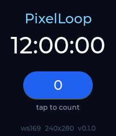

# PixelLoop

[](https://github.com/teemow/pixelloop/actions/workflows/build.yml)

An operating system for ESP32 displays, built by coding agents, with the
**hardware-in-the-loop test loop** that makes agent development possible:

```
change code  →  flash the device  →  drive the UI  →  screenshot  →  iterate
```

Everything an agent needs is a `make` target, everything it sees is a file
under `artifacts/`. The first target hardware is the Waveshare
ESP32-S3-Touch-LCD family (round and rectangular, 1.28" to 7"), but the board
layer is the only part that knows about a specific panel.

## Status

The loop runs end to end on the Waveshare ESP32-S3-Touch-LCD-1.69 (`ws169`):



| step | command | takes |
|---|---|---|
| identify the board (chip, flash, PSRAM, I2C fingerprint) | `make probe` | ~10 s after flashing |
| build + flash the OS (ESP-IDF 5.5, LVGL 9) | `make flash` | ~15 s incremental |
| reset and wait for `PIXELLOOP-READY` | `make run` | 1.2 s boot |
| framebuffer screenshot as PNG | `make shot NAME=home` | 0.6 s |
| scripted taps/swipes + screenshots | `make drive SCRIPT=tests/smoke.txt` | ~4 s |
| golden-image regression | `make test` | ~4 s |

The screenshot above is `tests/golden/ws169/smoke--home.png`, taken by the
device itself over USB. Next: the desktop simulator, more boards from the
family (`boards/README.md` has their pinouts), and real apps.

## Quick start

```sh
git clone https://github.com/teemow/pixelloop && cd pixelloop
make probe                  # plug in the board first; writes artifacts/probe.json
make run                    # flash the OS for the identified board, capture boot log
make shot NAME=home         # artifacts/home.png
make drive SCRIPT=tests/smoke.txt
```

Requirements: PlatformIO (`pip install platformio` or your distro package),
`uv`, and a user that may open `/dev/ttyACM*`. Optional: `ffmpeg` for webcam
photos of the physical board.

## Why a loop and not a simulator only

A desktop simulator gives fast, deterministic screenshots, and PixelLoop will
have one. But displays are hardware: SPI timings, PSRAM bandwidth, touch
controller quirks, backlight PWM and panel orientation only show up on the real
thing. The loop makes the real thing as cheap to poke as the simulator.

## Layout

See [AGENTS.md](AGENTS.md#layout). Board pinouts live in
[boards/README.md](boards/README.md).

## License

[MIT](LICENSE)
